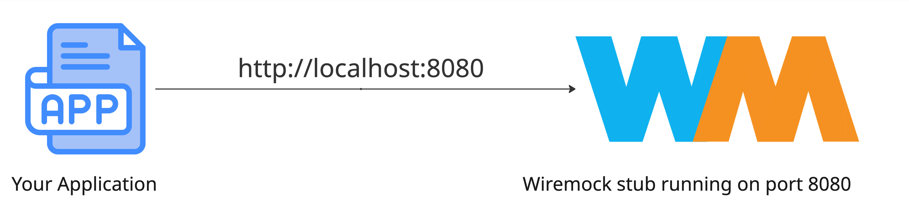
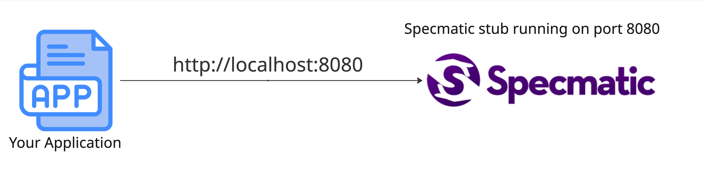

# Converting wiremock stubs to Specmatic

This repository demonstrates how you can convert Wiremock stubs to Specmatic stubs.

## Prerequisites

- Wiremock docker image
- Specmatic docker image

## Wiremock Stubs

The wiremock stubs in this example contain responses for github user API requests. The stubs are defined for the following endpoints:

- `GET /users/octocat`
- `GET /repos/octocat/Hello-World`

The Wiremock stubs are located in the `wiremock-stubs` directory.

## Specmatic proxy — diagrams and quick run notes

Below are two diagrams showing the current setup (application -> Wiremock) and a new setup with a Specmatic proxy inserted between your application and Wiremock.

### Current setup (application -> Wiremock)



_Figure: Current setup where the application calls Wiremock directly at http://localhost:8080._

Quick summary:

- Wiremock runs in Docker and serves stubbed HTTP responses on port 8080.
- Your application makes requests directly to http://localhost:8080.

### Setup for migration (with Specmatic proxy intercepting traffic)

Introduce a Specmatic proxy between your app and Wiremock so Specmatic can record, validate or convert traffic while forwarding requests to Wiremock. Your application will continue to make requests to http://localhost:8080, but those requests will now go to the Specmatic proxy, which in turn forwards them to Wiremock running on a different port (e.g., 9090).


_Figure: New setup where the application calls Specmatic proxy at http://localhost:8080, which forwards to Wiremock at http://localhost:9090._

Notes — quick run examples

- Run Wiremock:

  ```bash
  docker run -it --rm \
    -p 9090:8080 \
    --name wiremock \
    -v $(pwd)/wiremock-stubs:/home/wiremock \
    wiremock/wiremock --port 8080
  ```

- Run Specmatic as a proxy that forwards to Wiremock:

  Specmatic (Docker) — using `host.docker.internal` to reach Wiremock on the host:

  ```bash
  docker run --rm -p 8080:8080 \
    -v $(pwd)/specmatic-outdir:/specmatic-outdir \
    specmatic/specmatic:latest \
    proxy --port 8080 --target http://host.docker.internal:9090 /specmatic-outdir
  ```

- Recording traffic:

  Make requests to the Specmatic proxy (which forwards to Wiremock). This simulates your application making requests to the Specmatic proxy instead of directly to Wiremock.

    ```bash
    curl -X GET http://localhost:8080/users/octocat
    curl -X GET http://localhost:8080/repos/octocat/Hello-World
    ```

- Stop recording by stopping the Specmatic proxy (Ctrl+C). The recorded stubs will be available in the `specmatic-outdir` directory.
- Stop the wiremock server by stopping the Docker container (Ctrl+C).

### New setup (with Specmatic serving stubs)

Run specmatic as a stub server serving the recorded stubs on port 8080.



_Figure: New setup where Specmatic serves stubs at http://localhost:8080._


```bash
  docker run --rm -p 8080:8080 \
    -v $(pwd)/specmatic-outdir:/specmatic-outdir \
    specmatic/specmatic:latest \
    stub --port 8080 /specmatic-outdir/proxy_generated.yaml
```
